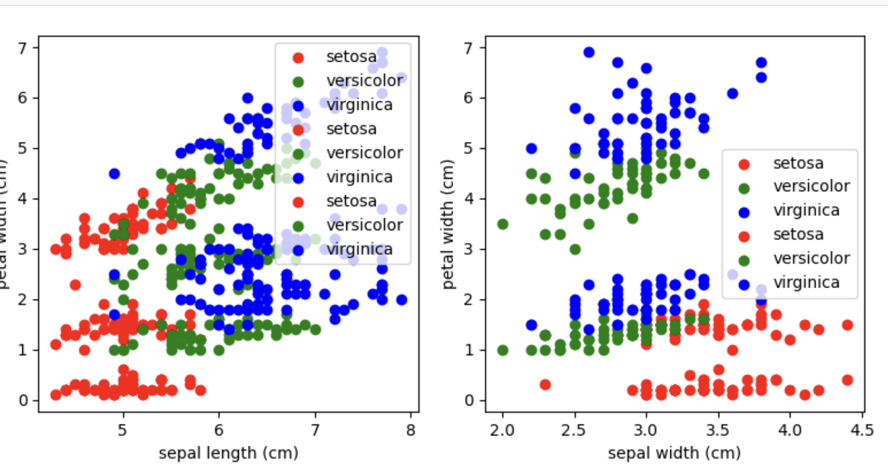

# Back propagation using simple binary classification

The purpose of this repositoty is to explain the mathematical concepts behind back propagation in neural networks.

Details can be found in this medium post: https://medium.com/@JayMuthialu/backpropagation-simplified-2c8676e94657

